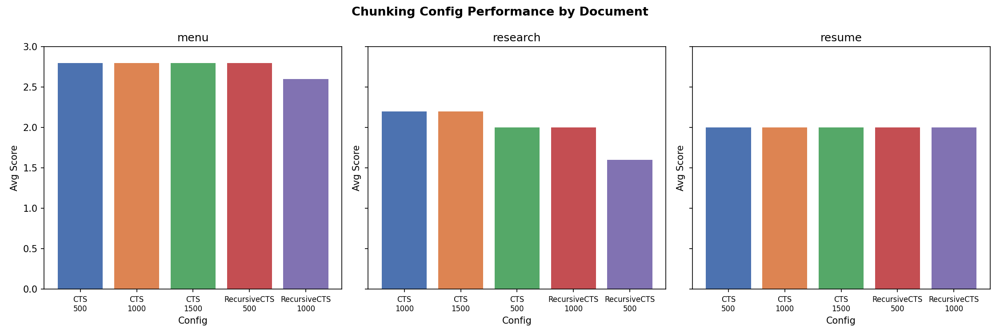

# RAG-Powered Document Q&A System
A Retrieval-Augmented Generation pipeline for multi-format document Q&A using FAISS vector search and Groq's LLaMA 3.3 70B — with a chunking ablation study across 3 document types and 5 configs.

---

## How It Works
1. **Upload** a PDF, DOCX, TXT, or paste raw text
2. **Chunk** via `CharacterTextSplitter` or `RecursiveCharacterTextSplitter`
3. **Embed** using `sentence-transformers/all-mpnet-base-v2` → stored in FAISS `IndexFlatL2`
4. **Query** retrieves top-k=4 chunks → passed to Groq LLaMA 3.3 70B with a strict context-grounded prompt
5. **Fallback** — if Groq API fails, returns raw retrieved chunks directly

---

## Chunking Ablation Study
Evaluated 5 chunking configs across 3 document types (menu, research paper, resume) — 75 total query-answer pairs scored on a 1–3 scale (1=wrong, 2=partial, 3=correct).



| Doc Type | Best Config | Avg Score | Worst Config | Avg Score |
|---|---|---|---|---|
| Menu (structured) | CTS 500/1000/1500 | 2.8 | RCTS 1000 | 2.6 |
| Research (academic) | CTS 1000 | 2.2 | RCTS 500 | 1.6 |
| Resume (dense/short) | All configs tied | 2.0 | — | — |

**Key finding:** `CharacterTextSplitter` at chunk_size=1000 is the optimal overall config. `RecursiveCharacterTextSplitter` at chunk_size=500 performed worst on academic text (1.6/3) — smaller chunks fragment context in long-form documents.

---

## Tech Stack
| Component | Tool |
|---|---|
| UI | Streamlit |
| Vector Store | FAISS (IndexFlatL2) |
| Embeddings | Hugging Face (all-mpnet-base-v2) |
| LLM | Groq API — llama-3.3-70b-versatile |
| Document Parsing | PyPDF2, python-docx |
| Evaluation | Manual scoring (1–3 scale), matplotlib |

---

## Setup
```bash
git clone https://github.com/nandiniranjansinha/RAG-Powered-Document-Q-A-System.git
cd RAG-Powered-Document-Q-A-System
pip install -r requirements.txt
```

Create a `.env` file:
```
GROQ_API_KEY=your_groq_api_key
HUGGINGFACEHUB_API_TOKEN=your_huggingface_api_key
```

```bash
streamlit run app.py
```

---

## Project Structure
```
├── app.py                        # Main Streamlit app
├── evaluate_chunking.ipynb       # Chunking ablation study
├── chunking_evaluation.csv       # Raw evaluation results (75 rows)
├── chunking_evaluation_chart.png # Results visualization
├── requirements.txt
├── .env                          # API keys (never commit this)
├── .env.example                  # Template for API keys
└── .gitignore
```

---

## Key Findings
- **CTS-1000 is optimal** across document types — best on academic text (2.2/3), tied best on structured data (2.8/3)
- **RCTS-500 fails on academic text** (1.6/3) — small chunks fragment multi-sentence arguments
- **Short dense documents (resume)** are insensitive to chunking strategy — all configs score 2.0/3
- **Structured documents (menu)** are easiest to retrieve from regardless of config

---

## Known Limitations
- Manual scoring introduces subjectivity — RAGAS-based automated scoring planned
- FAISS index is in-memory only (no persistence across sessions)
- `normalize_embeddings=False` — effect on ranking quality unexplored
- Single-document vectorstore per session — no cross-document retrieval

---

## Next Iteration
- Integrate RAGAS faithfulness + relevancy scoring to replace manual evaluation
- Test semantic chunking (split on meaning, not character count)
- Explore `normalize_embeddings=True` effect on ranking for longer documents
- Persistent FAISS index across sessions
